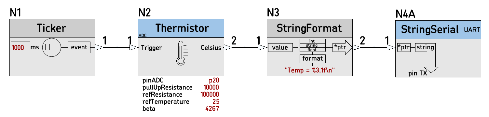
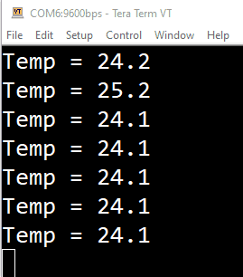
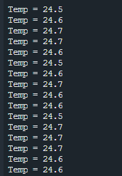
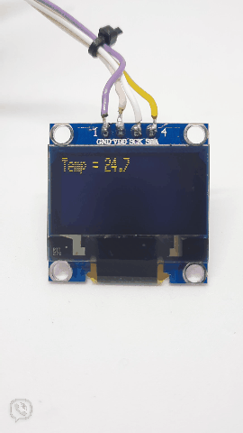
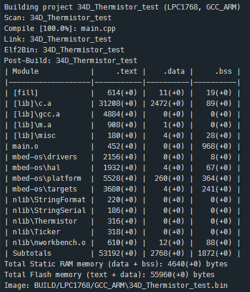
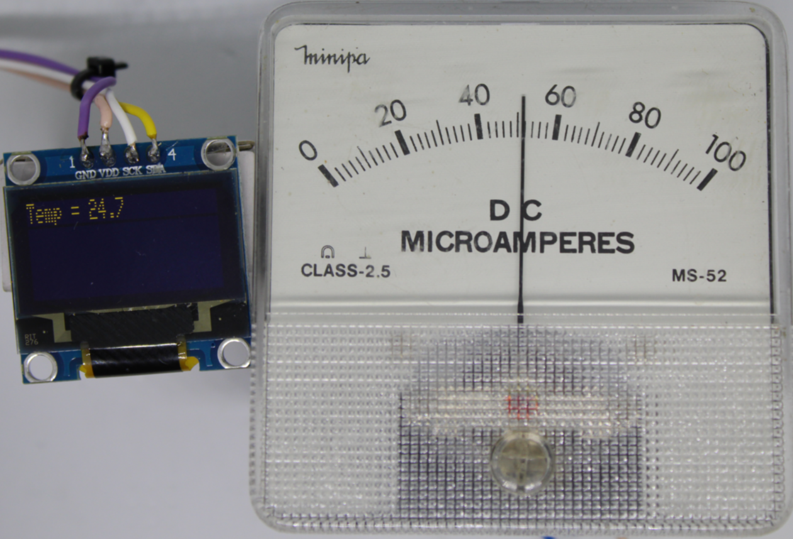
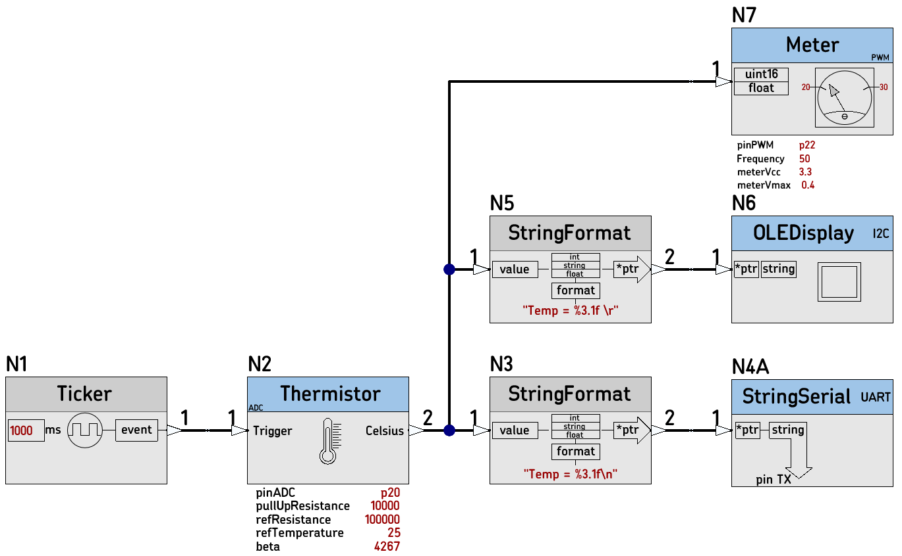
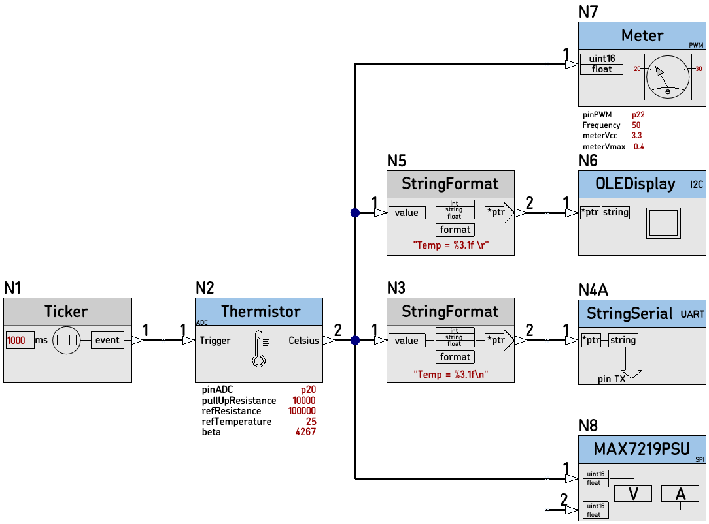

# [34D_Thermistor_test](https://github.com/nBlocksStudioApps/34D_Thermistor_test_FIRMWARE.git)

C++ project created automatically from the [34D_Thermistor_test schematic design](https://github.com/nBlocksStudioApps/34D_Thermistor_test_SCHEMATIC),
to test the new Node [Thermistor](https://github.com/nBlocksStudioNodes/nblocks_Thermistor)

## Schematic Design

## Output to terminal

## Output to terminal
Added OLED display and soldered a capacitor to stabilize the measurement

## Compilation

## Added Meter Node driving a moving-coil meter
The [Meter](https://github.com/nBlocksStudioNodes/nblocks_meter) Node is parameterized so 25'C is at the center.

## Schematic Design with added Meter
The moving-coil meter, has maximum input voltage `meterVmax=0.4V` and the `Vcc =3.3V` (the microcontroller supply voltage) since we don't use any driving transistor.

## Schematic Design with added MAX7219PSU 
Added a MAX7219PSU Node and board to display the tepmerature with 7-segment Led display. [MAX7219PSU Node](https://github.com/nBlocksStudioNodes/nblocks_max7219psu) updated to work with `float` type input values

 
 
----

## KernelNode

----

Three types of Temperature display:
 * I2C OLED graphics display
 * Analog moving-coil meter (driven directly from a Microprocessor PIN)
 * SPI 7-Segment-Led Display

   

----